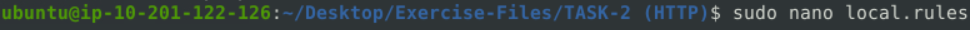
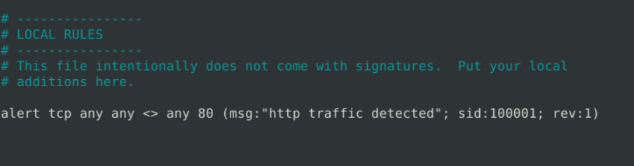
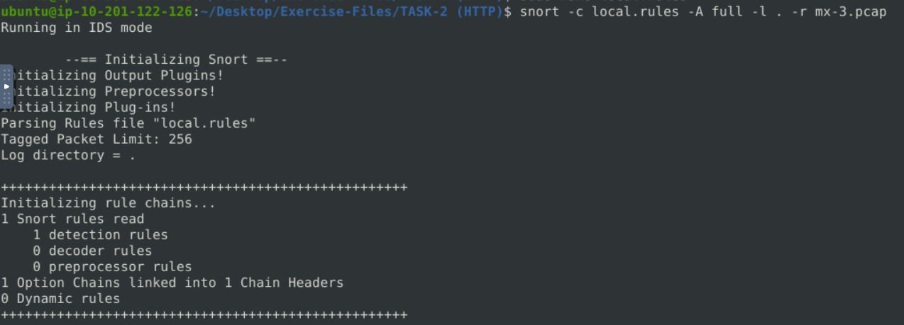
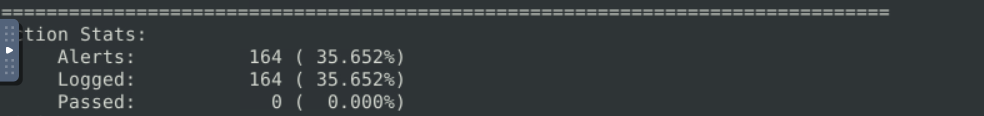

#### This walkthrough covers a step-by-step approach to tackling the Snort Challenge - The Basics room. 

#### First things first - start the attached VM since it needs a few minutes to boot up completely.

### Task 2: Writing IDS Rules (HTTP)

This task is all about detecting HTTP traffic so focus only on that.

The room mentioned that you must have to find the answer for this question before answering all the other question.

Q1. Write a rule to detect all TCP packets **from or to** port 80.  
What is the number of detected packets you got?
	
	1. Go to the required task files that contains the Exercise files.
		~/Desktop/Exercise-Files/TASK-2 (HTTP)$ 

	2.Open the rules file 
	

	3.edit it with the following rule 

		`alert tcp any any -> any 80 (msg:"HTTP traffic detected"; sid:100001; rev :1)`

	this rule captures all the http traffic, save it.

	4. Run this rule against the pcap file.

		snort -c local.rules -A full -l . -r mx-3.pcap
		

	This generates the alert file and a log file you can either check the alerts in that or at the end of detection result. 

Answer: 164

These processes and methods are going to repeat in this entire snort room so I will not mention the entire commands throughout the room you have to remember that.